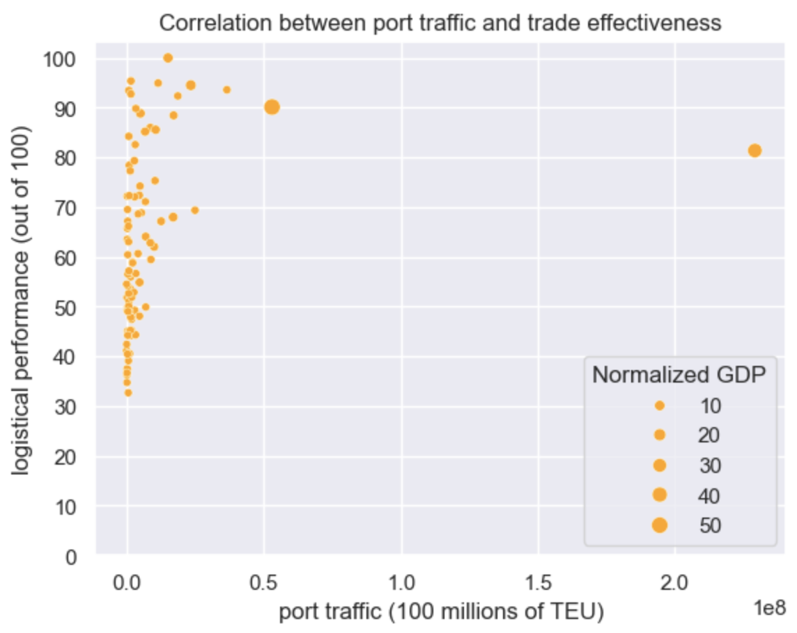
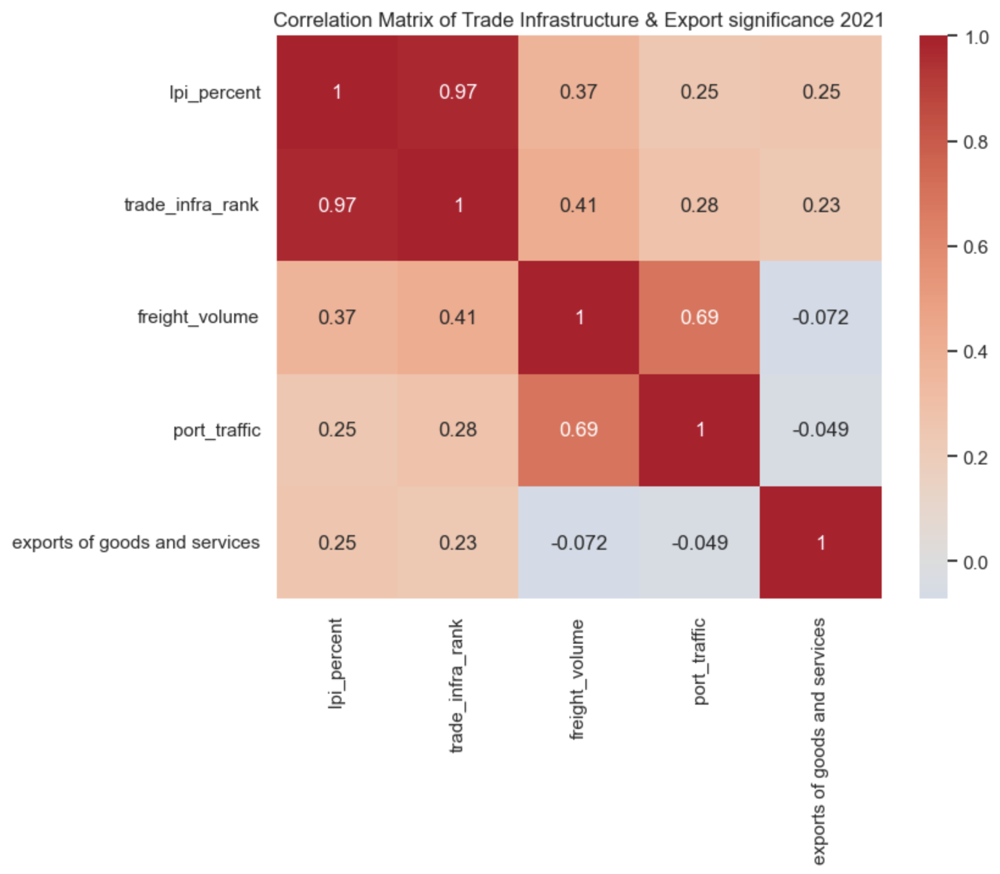

## async-final-project-orange-Michael

## Dataset
[World Bank World Development Indicators](https://databank.worldbank.org/source/world-development-indicators)

## Why did I chose this dataset?

 I wanted to do a data analysis project on the economic clash between the United States and China. Specifically, I wanted to investigate how a country's infrastructure impacts its economic well being. Using data about the growth of an economy (due to infra) using indicators from the world bank, I can predict how China and the USA’s infrastructure policies impact their economies.

## Questions
- [ ] Question 1: What countries comprise the 20 largest GDPs in the world?
  - Answer: The USA leads with China behind, and Japan is in the podium
  - Visualization: 

- [ ] Question 2: Which countries consume the most electricity per capita today?
  - Answer: Iceland takes up the most electricy per capita, i expect it's due to the heating services
  - Visualization: 

- [ ] Question 3: Do larger or smaller countries have more exports as a percent of their GDP?
  - Answer: We see a greater export percentage with emerging/growing economies
  - Visualization: 

- [ ] Question 4: How is access to electricity affected in a growing country?
  - Answer: As India grew, it bolstered its energy infrastructure to match the growth
  - Visualization: 

- [ ] Question 5: How has technology services shaped the world's exports?
  - Answer: ICT exports have grown over the past 20 years, but the median still hovers at less than 10%, with the growth being in most outliers
  - Visualization: 

- [ ] Question 6: Is the world developing it's renewable energy sector?
  - Answer: % of renewable energy use out of total grew by roughly 2% in the past ten years
  - Visualization: 

- [ ] Question 7: Do countries with higher electricity consumption per capita also have higher labor productivity?
  - Answer: There seems to be a positive correlation between electricity consumption and worker productivity
  - Visualization: 

- [ ] Question 8: Does more effective trading infrastructure equate to more trades?
  - Answer: Although countries with high port traffic have high quality infrastructure, it doesn't mean countries with high quality infrastructure have high port traffic
  - Visualization: 

- [ ] Question 9: As urbanization increases, does the productivity of each worker increase as well?
  - Answer: While China's urbanization and worker productivity increased proportionally, I don't think they're correlated due to the US's worker productvity increasing while it's urbanization remained stagnant
  - Visualization: 

- [ ] Question 10: What Factors are most attributed to increases in exports?
  - Answer: Suprisingly, freight volume and port traffic have no correlation to a country's exports as a% of GDP, there is a slight correlation between exports and trade infrastructure quality
  - Visualization: 
